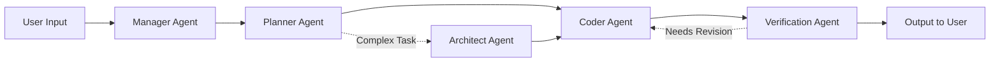

<p align="center">
  
  
  
  
</p>

<p align="center">
  <pre style="font-size: 10px; line-height: 1.2;">
   ______            __              _     
  / ____/______  __ / /_ ____  ____ ( )_  __
 / /   / ___/ / / // __// __ \/ __ \|/| |/_/
/ /___/ /  / /_/ // /_ / /_/ / / / / _>  <  
\____/_/   \__, / \__/ \____/_/ /_/ /_/|_|  
          /____/                            
  </pre>
</p>

<h1 align="center">🚀 Crytonix</h1>

<p align="center">
  <strong>The AI-Powered Multi-Agent Coding Assistant</strong><br>
  <em>Your Personal J.A.R.V.I.S. for Software Development</em>
</p>

<p align="center">
  <a href="#-features">Features</a> •
  <a href="#-quick-start">Quick Start</a> •
  <a href="#-voice-mode">Voice Mode</a> •
  <a href="#-toolboxes">Toolboxes</a> •
  <a href="#-architecture">Architecture</a>
</p>

---

## ✨ Features

### 🤖 Multi-Agent Architecture
Crytonix orchestrates multiple specialized AI agents that collaborate to understand, plan, and execute your coding tasks:

| Agent | Role | Specialty |
|-------|------|-----------|
| **Manager** | 🎯 Product Owner | Refines requirements, manages scope |
| **Planner** | 📋 Architect | Designs solutions, breaks down tasks |
| **Coder** | 💻 Developer | Writes and refines code |
| **Architect** | 🏗️ System Design | High-level architecture decisions |
| **Verification** | ✅ QA Engineer | Reviews and validates output |

### 🎤 Jervis Voice Mode
Experience the future with our **premium voice assistant interface**:
- 🗣️ **Natural Speech Recognition** - Talk to your code
- 🔊 **Text-to-Speech** - Hear responses in natural voice
- 🌐 **Wake Word Detection** - "Hey Crytonix" activation
- 🎨 **Animated Voice Orb** - Futuristic visual feedback
- 📱 **Compact Widget Mode** - Always-on-top floating assistant

### 🌐 LLM Provider Agnostic
Choose your AI backend:
- **Google Gemini** - Advanced reasoning
- **Groq** - Lightning-fast inference
- **OpenRouter** - Access to 100+ models

### 🔧 50+ Built-in Toolboxes
Comprehensive toolkit for every development need:

```
📁 Core         │ 🔍 Code Analysis  │ 🧪 Testing     │ 🔐 Security
🐙 GitHub       │ 🌐 Web Research   │ 🐳 DevOps      │ 📊 Database
📝 Documentation│ 🎨 Design         │ 🖼️ Assets      │ 📦 Scaffolding
⚡ Performance  │ 🧠 AI/LLM         │ 📡 Monitoring  │ 🔄 Refactoring
```

---

## 🚀 Quick Start

### Installation

```bash
# Clone the repository
git clone https://github.com/yourusername/crytonix.git
cd crytonix

# Install dependencies
pip install -e .

# For voice mode (optional)
pip install -r requirements-voice.txt
```

### Configuration

Create `~/.crytonix/config.json`:

```json
{
  "provider": "google",
  "api_key": "your-api-key-here"
}
```

Or set environment variables:

```bash
# Google Gemini
export GOOGLE_API_KEY="your_key"

# Groq
export GROQ_API_KEY="your_key"

# OpenRouter
export OPENROUTER_API_KEY="your_key"
```

### Launch

```bash
# Terminal Mode
crytonix

# Voice Mode (GUI)
crytonix --voice

# Voice Mode (Compact Widget)
crytonix --voice --widget
```

---

## 🎤 Voice Mode

<p align="center">
  
</p>

### Jervis Mode Features

| Feature | Description |
|---------|-------------|
| 🎙️ **Listen** | Chrome-powered speech recognition |
| 🔊 **Speak** | Natural TTS with multiple voices |
| ✨ **Wake Word** | Hands-free activation |
| 🎨 **Voice Orb** | Animated visual feedback |
| 📜 **Chat History** | Full conversation log |

### Voice Commands

```
"Hey Crytonix, create a React component for user login"
"Analyze the complexity of my Python files"
"Run the tests and show me the coverage"
"Deploy to Docker with the latest changes"
"Exit" / "Goodbye" / "Stop"
```

---

## 🧰 Toolboxes

### Core Toolbox
```python
list_files(path)          # List directory contents
read_file(path)           # Read file content
write_file(path, content) # Write to file
replace_in_file(...)      # Search & replace
search_code(pattern)      # Regex code search
run_command(cmd)          # Execute shell commands
```

### GitHub Toolbox
```python
list_issues(limit)        # List repository issues
get_issue(number)         # Get issue details
create_pr(title, body)    # Create pull request
list_prs(limit)           # List pull requests
```

### Code Analysis Toolbox
```python
analyze_code_complexity(path)  # Cyclomatic complexity
find_dependencies(path)        # Extract imports
lint_code(path)                # Run linters
format_code(path)              # Auto-format code
detect_code_smells(path)       # Find anti-patterns
```

### Testing Toolbox
```python
run_tests(path)                # Run pytest
run_specific_test(path)        # Run single test
check_test_coverage(path)      # Coverage report
generate_test_skeleton(file)   # Generate test stubs
```

### Security Toolbox
```python
scan_vulnerabilities(path)     # Security scan (bandit)
check_secrets(path)            # Find leaked secrets
validate_dependencies()        # Check for CVEs
```

### DevOps Toolbox
```python
docker_build(tag)              # Build Docker image
docker_run(image, ports)       # Run container
list_containers()              # List containers
read_logs(container)           # Read container logs
```

### Web Research Toolbox
```python
search_web(query)              # DuckDuckGo search
read_url(url)                  # Extract webpage content
```

### Performance Toolbox
```python
profile_code(path)             # cProfile analysis
memory_profiler(path)          # Memory usage
benchmark_function(code)       # Benchmark snippets
find_slow_operations(log)      # Parse for bottlenecks
```

### + 10 More Toolboxes
- **Database & API** - SQLite queries, HTTP requests
- **Documentation** - README generation, API docs, changelogs
- **Asset Management** - Image optimization, color extraction
- **Project Scaffolding** - Python/React project templates
- **Memory** - Persistent snippet storage
- **Design** - Contrast checking, color validation
- **Product** - RICE scoring, sentiment analysis
- **Monitoring** - Log parsing, metrics
- **Refactoring** - Code transformations
- **Migration** - Database migrations

---

## 🏗️ Architecture

```
crytonix/
├── main.py              # CLI entry point
├── voice.py             # Jervis voice engine
├── voice_gui.py         # Premium voice GUI
├── tools.py             # 50+ toolboxes (2500+ lines)
├── server.py            # Local preview server
│
├── agents/
│   ├── base.py          # BaseAgent with tool execution
│   ├── manager.py       # Product Manager agent
│   ├── planner.py       # Solution Architect agent
│   ├── coding.py        # Developer agent
│   ├── architect.py     # System Design agent
│   └── verification.py  # QA/Review agent
│
├── llm/
│   └── providers/       # LLM provider integrations
│
└── audio/
    └── sounds/          # Voice mode sound effects
```

### Agent Workflow



---

## 📋 Requirements

### Core
- Python 3.8+
- `google-generativeai` or `groq` or `openrouter`
- `rich` - Beautiful terminal UI

### Voice Mode (Optional)
- `SpeechRecognition` - Audio capture
- `pyttsx3` - Text-to-speech
- `pyaudio` - Audio I/O
- `customtkinter` - Modern GUI (recommended)

---

## 🎨 Design Philosophy

> *"Software should have a soul."*

Crytonix is built with the **Whimsy Injector** mindset:
- 🌙 **Dark Mode First** - Easy on the eyes
- ✨ **Micro-Animations** - Delightful interactions
- 🎭 **Premium Aesthetics** - Not just functional, but beautiful
- 🤖 **Human-Centered AI** - AI that feels like a partner

---

## 🤝 Contributing

Contributions are welcome! Please feel free to submit a Pull Request.

1. Fork the repository
2. Create your feature branch (`git checkout -b feature/AmazingFeature`)
3. Commit your changes (`git commit -m 'Add some AmazingFeature'`)
4. Push to the branch (`git push origin feature/AmazingFeature`)
5. Open a Pull Request

---

## 📄 License

This project is licensed under the MIT License - see the [LICENSE](LICENSE) file for details.

---

<p align="center">
  <strong>Built with 💜 by the Crytonix Team</strong><br>
  <em>Making AI-assisted coding feel like magic</em>
</p>

<p align="center">
  <a href="https://github.com/yourusername/crytonix/stargazers">⭐ Star us on GitHub</a>
</p>
